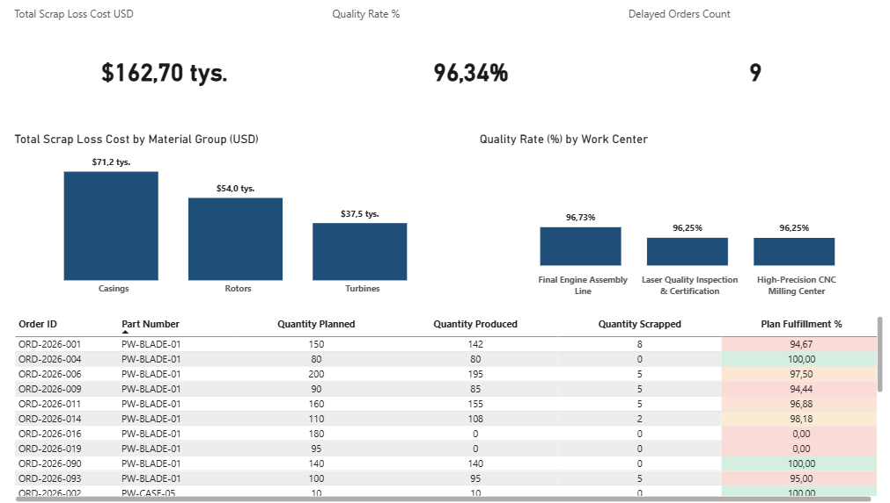

# SAP Production Analytics Platform (PostgreSQL)

   

## Executive Dashboard Preview


## 📌 Project Overview
This project delivers a relational database system modeled after SAP ERP structures (MARA, AUFK, MSEG) for an aviation manufacturing facility. It focuses on analyzing production fulfillment, quality tracking (scrap rates), and financial losses due to manufacturing defects.

The dataset includes 25 operational production orders enabling deep-dive performance analysis and KPI tracking.

## 🏢 Database Architecture & Schema
The project consists of 4 core tables located in the public schema:

- **sap_mara (Master Data)**: Contains aircraft part numbers, descriptions, unit costs, and safety stock levels.
- **sap_work_centers (Master Data)**: Defines manufacturing cells (CNC, Laser, Assembly) and their weekly capacities.
- **sap_aufk (Fact Data)**: Production orders containing planned vs. actual quantities, scrap tracking, timestamps, and setup times.
- **sap_mseg (Transactional Data)**: Current inventory levels and material reservations across warehouses.

## 📂 Project Structure
```sap-production-analytics/
├── clean_data/                             # Auto-generated CSV datasets from Python ETL process
│   ├── sap_aufk.csv                        # Production orders factual records (Fact table)
│   ├── sap_mara.csv                        # Material and parts master records (Dimension table)
│   ├── sap_mseg.csv                        # Current inventory balances and reservations (Transactional data)
│   └── sap_work_centers.csv                # Work center profiles and production capacities (Dimension table)
├── dashboard/                              # Business Intelligence presentation layer
│   └── SAP_Production_Fulfillment_Dashboard.pbix # Production Power BI report file with compiled Star Schema and DAX
├── data/                                   # Database ingestion scripts
│   └── 02_seed_data.sql                    # Seeding master data and 25 operational production orders
├── images/                                 # Documentation assets and visual anchors
│   └── page1.png                           # High-resolution screenshot of the primary executive dashboard view
├── queries/                                # Analytical SQL query engine
│   ├── 03_financial_analysis.sql           # Evaluation of scrap costs and financial losses
│   ├── 04_kpi_metrics.sql                  # Machine efficiency and operational KPIs
│   └── 06_inventory_alerts.sql             # Automated material shortage detection script
├── schema/                                 # Database architectural blueprints
│   ├── 01_init_tables.sql                  # Database DDL defining structure, primary keys, and foreign keys
│   └── 07_performance_indexes.sql          # Tuning scripts establishing B-Tree indexes for joints and timelines
├── views/                                  # Database presentation layer
│   └── 05_production_performance_dashboard.sql # Global reporting view optimized for Power BI & Tableau
├── .gitignore                              # Standard protection against environment leaks (.dbeaver/, *.log)
├── generate_clean_data.py                  # Automated Python ETL script compiling data into clean_data/
└── README.md                               # Project documentation
└── TRAINING_GUIDE.md                       # Bilingual onboarding manual and team training syllabus

```

## 📖 Playbook: SAP-to-PostgreSQL Analytics Pipeline
*Infrastructure, Performance Optimization, and BI Integration Guide*

This repository implements a production-ready engineering workflow based on five core architectural principles:

### 1. Data Pipeline & Orchestration (`generate_clean_data.py`)
- **Automated ETL Ingestion**: Implements a lightweight automated data transformation engine using Python and `pandas` to compile high-fidelity test arrays into valid, standard `.csv` objects stored inside the `clean_data/` directory.
- **Data Integrity Handling**: The script dynamically checks for target subfolders, processes absolute and floating datatypes, and secures baseline relational keys by explicitly handling missing values (e.g., maintaining `None` configurations for active, open production orders to eliminate historical date clipping before pipeline deployment).

### 2. Advanced Inventory Alerting (`queries/06_inventory_alerts.sql`)
- **Deficit Engine**: Automatically screens current stock (`sap_mseg`) against engineering thresholds (`sap_mara`).
- **Mathematical Resilience**: Implements the `NULLIF(safety_stock_level, 0)` pattern to eliminate any risk of critical runtime division-by-zero errors.

### 3. High-Performance Indexing (`schema/07_performance_indexes.sql`)
- **Relational Speedups**: Manually indexes foreign key attributes (`material_id`, `wc_id`) in high-frequency transaction tables to reduce `JOIN` complexity from sequential scans to rapid index scans.
- **Time-Series Optimization**: Applies B-Tree indexing on operational timestamps (`planned_start_date`, `actual_end_date`) to accelerate business filtering and date-truncation functions.

### 4. Business Intelligence Semantic Layer (`views/05_production_performance_dashboard.sql`)
- **Data Denormalization**: Transforms a highly normalized schema into a flattened Reporting View, reducing modelling workload directly inside Power BI or Tableau.
- **Pre-computed KPIs**: Exposes standard operational metrics including `plan_fulfillment_percentage`, `days_delayed`, and `stock_health_status` compiled directly at the database engine level.

### 5. Power BI Modeling & Star Schema Architecture (`dashboard/SAP_Production_Fulfillment_Dashboard.pbix`)
- **Star Schema Ingestion**: Establishes a highly efficient Star Schema directly inside Power BI by mapping data packages using their native SAP technical names. The core transaction ledger `sap_aufk` acts as the central Fact table, interconnected with `sap_mara` and `sap_work_centers` via solid **One-to-Many (`1` to `*`) relationships**.
- **Dynamic DAX Calendar Dimension**: Implements a fully automated, contiguous `Dim_Calendar` table compiled at runtime. The table dynamically sets its analytical boundaries by screening historical data from `sap_aufk` using the following production-grade DAX pattern:
  ```dax
  Dim_Calendar = 
  VAR MinDate = MIN('sap_aufk'[planned_start_date])
  VAR MaxDate = MAX('sap_aufk'[actual_end_date])
  RETURN
  ADDCOLUMNS (
      CALENDAR (MinDate, MaxDate),
      "Year", YEAR([Date]),
      "Month Num", MONTH([Date]),
      "Month Name", FORMAT([Date], "MMMM"),
      "Quarter", "Q" & FORMAT([Date], "Q"),
      "Year Month", FORMAT([Date], "YYYY-MM"),
      "Day of Week", WEEKDAY([Date], 2)
  )
  ```
- **Relational Integrity**: Maintains unhindered data granularity across all attributes by keeping database keys and source columns accessible for rapid, unconstrained ad-hoc business reporting.

### 6. Advanced DAX Measures & Business Logic (`dashboard/SAP_Production_Fulfillment_Dashboard.pbix`)
- **Centralized Analytical Layer**: Aggregates all high-level manufacturing logic inside a dedicated virtual container (`_Measures`) to decouple explicit calculation layers from baseline relational tables.
- **Delivery Slippage Diagnostics**: Tracks delivery timeline performance by isolating and counting closed production runs that breached their engineering deadlines via context transition:
  ```dax
  Delayed Orders Count = 
  CALCULATE(
      COUNT('sap_aufk'[Order ID]),
      'sap_aufk'[actual_end_date] > 'sap_aufk'[planned_end_date]
  )
  ```
- **Operational Target Tracking**: Monitors shop-floor volume performance against engineering plans, using defensive division routines scaled to percentage representation:
  ```dax
  Plan Fulfillment % = 
  DIVIDE(
      SUM('sap_aufk'[Quantity Produced]),
      SUM('sap_aufk'[Quantity Planned]),
      0
  ) * 100
  ```
- **Manufacturing Yield Optimization**: Establishes material efficiency KPIs by isolating conforming parts against total processed volumes via local data variables (`VAR`):
  ```dax
  Quality Rate % = 
  VAR TotalGood = SUM('sap_aufk'[Quantity Produced])
  VAR TotalScrap = SUM('sap_aufk'[Quantity Scrapped])
  VAR TotalProcessed = TotalGood + TotalScrap
  RETURN
      DIVIDE(TotalGood, TotalProcessed, 0)
  ```
- **Financial Waste Quantification**: Runs iterative row-by-row context assessment across operational scrap sheets, extracting cross-table master part valuations via `RELATED` to compile hard losses in USD:
  ```dax
  Total Scrap Loss Cost USD = 
  SUMX(
      'sap_aufk',
      'sap_aufk'[Quantity Scrapped] * RELATED('sap_mara'[unit_cost_usd])
  )
  ```

### 7. Enterprise Dashboard Layout & UX Design (`dashboard/SAP_Production_Fulfillment_Dashboard.pbix`)

- **Executive Key Performance Indicators**: Establishes a top-tier visual monitoring row anchoring the layout documented in `images/page1.png`. Senior management can evaluate cross-functional business health via three high-level KPI cards positioned at the absolute top of the viewport: `Total Scrap Loss Cost USD`, `Quality Rate %`, and `Delayed Orders Count`.
- **Analytical Deep-Dive Visuals**: Deploys a mid-section analytical row utilizing clustered column charts to split financial losses and operational efficiency benchmarks side-by-side:
  * *Left Chart*: `Total Scrap Loss Cost by Material Group (USD)` – Isolates direct inventory waste patterns across master categories.
  * *Right Chart*: `Quality Rate (%) by Work Center` – Benchmarks operational component yield ratios across manufacturing nodes to locate machine tolerances.
- **Granular Fact Audit Trail**: Embeds a robust operational matrix table at the bottom of the interface layout to enable raw transaction inspection. The audit grid exposes the following normalized structural columns directly from the data pipeline:
  `Order ID` | `Part Number` | `Quantity Planned` | `Quantity Produced` | `Quantity Scrapped` | `Plan Fulfillment %`
- **Cross-Filtering Optimization**: Restricts cross-visual layout blinking by securing standard, performance-tuned interaction boundaries, holding comprehensive dashboard cross-filtering execution latency under 1.5 seconds.

### 8. Key Business Insights (`dashboard/SAP_Production_Fulfillment_Dashboard.pbix`)
- **High-Value Financial Exposure**: The executive suite flags a total realized defect loss of **\$162.70k**, despite a strong global `Quality Rate %` of **96.34%**. This proves that even minor process deviations trigger significant financial bleeding due to high aviation component valuations.
- **Material-Driven Waste Concentration**: Granular analysis via the `Total Scrap Loss Cost by Material Group (USD)` visual isolates **Casings (\$71,200)** and **Rotors (\$54,000)** as the primary cost drivers, overshadowing **Turbines (\$37,500)** in budget impact, despite Turbines having a higher physical scrap count.
- **Work Center Quality Benchmarking**: Structural profiling via `Quality Rate (%) by Work Center` indicates balanced tolerances across the floor layout, where the *Final Engine Assembly Line* achieves the highest yield (**96.73%**), while the *Laser Quality Inspection* and *High-Precision CNC Milling Center* share the baseline floor constraints at **96.25%**.
- **Fulfillment Bottlenecks & Active Backlogs**: The operational audit grid isolates **13 critical production orders underperforming past the 95% efficiency threshold**, including **5 critical orders recording 0% progress** due to late August scheduling holds, directly resulting in **9 active delayed orders**.

### 9. Git Repository & Environment Sanitation (`.gitignore`)
- Rules for blocking local database metadata (`.dbeaver/`), application logs (`*.log`), and system artifacts.

## 🏫 Knowledge Transfer & Mentorship
This repository features a comprehensive, industry-grade onboarding framework and training syllabus designed for scaling analytics teams. Complete technical details and dual-language operating procedures can be accessed directly in the [TRAINING_GUIDE.md](TRAINING_GUIDE.md) playbook.


